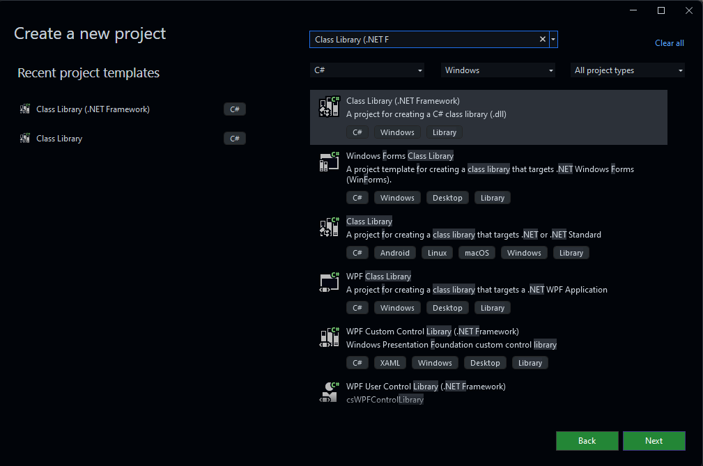

# Development Environment

## Prerequisites

- [Visual Studio](https://visualstudio.microsoft.com/) 2019 or newer
- [Visual Studio Code](https://code.visualstudio.com/) (optional)
- [Unity](https://unity.com/) 2019.4.28f1 or newer
- [Cities: Skylines](https://store.steampowered.com/app/255710/Cities_Skylines/) with the latest version

## Setting Up Your Development Environment

### Installing Visual Studio

1. Download and install [Visual Studio](https://visualstudio.microsoft.com/).
2. Launch Visual Studio and select the **Game Development with Unity** workload during installation.
3. Install any additional components required for Unity development.

### Installing Visual Studio Code (Optional)

1. Download and install [Visual Studio Code](https://code.visualstudio.com/).
2. Install the **C# for Visual Studio Code** extension from the Visual Studio Code Marketplace.

### Installing Unity

1. Download and install [Unity](https://unity.com/).

## Creating a new Visual Studio Project

1. After installing Visual Studio, launch the application.
2. Click on **Create a new project** with the "Class Library" template for C# projects.

<details>
  <summary>See screenshot</summary>
  
</details>

3. Choose a name and location for your project and click **Create**.
4. Add references to the Unity assemblies located in the `Managed` folder of your Cities: Skylines installation directory.
   - For Steam users, the default path is `C:\Program Files (x86)\Steam\steamapps\common\Cities_Skylines\Cities_Data\Managed`.
   - For Epic Games users, the default path is `C:\Program Files\Epic Games\CitiesSkylines\Cities_Data\Managed`.
   - For non-Steam users, the default path is `C:\Program Files (x86)\Cities Skylines\Cities_Data\Managed`.
   - For Mac users, the default path is `~/Library/Application Support/Steam/steamapps/common/Cities_Skylines/Cities.app/Contents/Managed`.
5. Start coding your mod using the Unity API and C# scripting.
6. Build your project and copy the resulting DLL file to the `Mods` folder of your Cities: Skylines installation directory. You can build the project by clicking on **Build** > **Build Solution** in Visual Studio or by using `ctrl + shift + b` keyboard shortcut.

## Debugging Your Mod

### Using Visual Studio

1. Open your project in Visual Studio.
2. Set breakpoints in your code by clicking on the left margin of the code editor.
3. Click on **Debug** > **Start Debugging** or press `F5` to start debugging your mod.
4. Attach the debugger to the Cities: Skylines process by selecting the appropriate process from the list.

### Using Visual Studio Code

1. Open your project in Visual Studio Code.
2. Set breakpoints in your code by clicking on the left margin of the code editor.
3. Click on **Run** > **Start Debugging** or press `F5` to start debugging your mod.
4. Attach the debugger to the Cities: Skylines process by selecting the appropriate process from the list.

## See Performance Metrics

### Using Visual Studio

1. Open your project in Visual Studio.
2. Click on **Debug** > **Performance Profiler** to open the Performance Profiler.
3. Select the desired profiling target (e.g., CPU Usage, Memory Usage, etc.).
4. Click on **Start** to start profiling your mod.
5. Analyze the performance metrics to identify bottlenecks and optimize your mod.

## Automatically Copying the Mod DLL to the `Mods` Folder (Optional)

To automatically copy the mod DLL to the `Mods` folder of Cities: Skylines after building the project, you can add a post-build event in Visual Studio.

### Using Visual Studio

1. Open your project in Visual Studio.
2. Right-click on your project in the Solution Explorer and select **Properties**.
3. Click on **Build Events** in the left pane.
4. Enter the following command in the **Post-build event command line** box to create and copy the mod DLL to the `Mods` folder of Cities: Skylines:

```bash
mkdir "%LOCALAPPDATA%\Colossal Order\Cities_Skylines\Addons\Mods\$(SolutionName)"
del "%LOCALAPPDATA%\Colossal Order\Cities_Skylines\Addons\Mods\$(SolutionName)\$(TargetFileName)"
xcopy /y "$(TargetPath)" "%LOCALAPPDATA%\Colossal Order\Cities_Skylines\Addons\Mods\$(SolutionName)"
```
