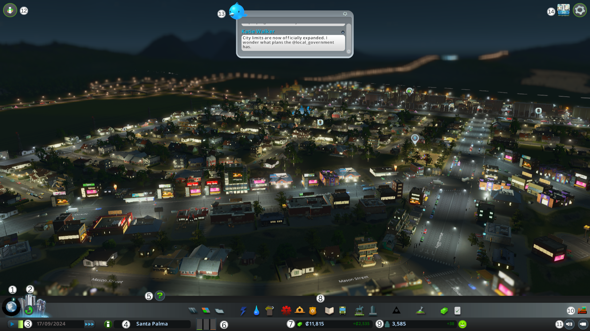

# Game Interface

1. **Areas**: allows toggling between area views and game views.
2. **Milestones**: allows viewing the requirements to unlock the next city level. It allows navigating back and forth with the arrow icons next to the progress bar.
3. **Game time**: shows the elapsed time of the game. The default speed of one week is one minute. You can see the current date in the game, as well as adjust the game speed with clicks.
4. **City name**: in a compact way, it shows the city's name. Clicking it shows more information about the city such as the total number of inhabitants, the number of houses, the number of workers, and the number of tourists. It also shows the total number of adults, teenagers, young adults, adults, and seniors. As well as the level of zones (residential, commercial, and industrial), the average land value, the city's attractiveness percentage, and active policies.
5. **Advisor**: toggles advisor visibility. The panel displays information and tips about the active tool or features when visible.
6. **Zone demands**: divides zoning demands into three columns. The green column represents residential zones, the blue one represents commercial zones, and the orange one represents industrial zones.

   Industry needs workers and customers, citizens need shops and groceries to meet their day-to-day needs, and businesses need customers to buy their products and services.

   <aside>
   💡 An imbalance in zoning will lead to unemployment, bankruptcy, and general discontent.

   </aside>

   This will lead to citizens abandoning buildings and/or negative population growth.

   <aside>
   💡 The more complete the zoning is the demand bar, the greater the need for zones of that type.

   </aside>

7. **Balance**: shows available funds and the weekly budget balance of income

8. **Service quality panels**: contains all the necessary tools to create the city and provide services to citizens:

   1. **Roads**: used to create roads.

   2. **Zoning**: allows configuring and removing zones
   3. **Districts**: used to manage districts and their industrial specializations.
   4. **Electricity**: allows building power lines and power plants.
   5. **Water services**: used to provide the city with clean water and the means to eliminate wastewater.
   6. **Garbage collection services**: allows managing garbage disposal.
   7. **Healthcare**: provides medical services to the city. It also allows honoring the dead.
   8. **Fire department**: used to manage fire safety.
   9. **Police department**: used to manage crime rates.
   10. **Education**: provides education to citizens.
   11. **Public transportation**: allows managing different public transport.
   12. **Decoration**: allows decorating and beautifying the city through decorations, parks, among others.
   13. **Unique buildings**: can select and place available unique buildings.
   14. **Monuments**: are the quintessential urban services.
   15. **Economy**: allows managing the economy, as well as
   16. **Policies**: allows managing city / district policies.
   17. **Population and happiness**: the population counter shows the number of citizens living in the city and the current population trend. Next to the counter is the happiness icon indicating the citizens' well-being.

9. **Bulldozer**: can be activated and deactivated from the button. When the mode is active, other tools and panels are disabled. It also allows demolishing roads, buildings, and other infrastructure by clicking on them.
10. **Free camera mode**: can be activated and deactivated. When the mode is active, it allows moving and controlling the view without restrictions. The user interface is hidden while the mode is active. To exit the mode, press the ESC key.
11. **Information views**: offers relevant information about the different services, resources, and issues with the city. The map view changes according to the selected item. Within each item, there may be different information tabs for each service.

    Information views are practical not only for tracking service coverage, water, and electricity on the map but also for predicting potential problems or growing needs in the city.

12. **Chirper**: is a kind of "social network" within the game. It shows citizens' "Chirps." It provides information about city events and developments, but can also reflect citizens' mood and opinions.

    This tool allows the player to get some valuable hints about citizens' well-being.

13. **Pause menu**: when opening the options menu, the game pauses and the following options are displayed:
    1. **Save the game**: overwrites the previous save file or creates a new one.
    2. **Load the game**: allows loading a saved game.
    3. **Options**: shows settings for graphics, audio, and the game.
    4. **Quit**: exits the game and returns to the main menu.

## Game Tips

In general, the game City Skylines is very simple. If you follow the indicators, it will facilitate the construction and management of services and the city in general.

Being a simulator, it does not have a defined gameplay pattern, but rather the user defines how they want to play it. The only important thing is that with the initial budget, start slowly to convert expenses into greater income.

**Some tips that could be given to improve the gaming experience are:**

1. Use districts to your advantage
2. Provide more than one route to the highway
3. Roundabouts are worth it
4. Connect things with roads
5. 12 percent is the perfect tax rate
6. Lower service budgets at the beginning
7. Plan for road upgrades
8. Carefully plan the city layout
9. Check early resources
10. Keep industry separated from other zones
